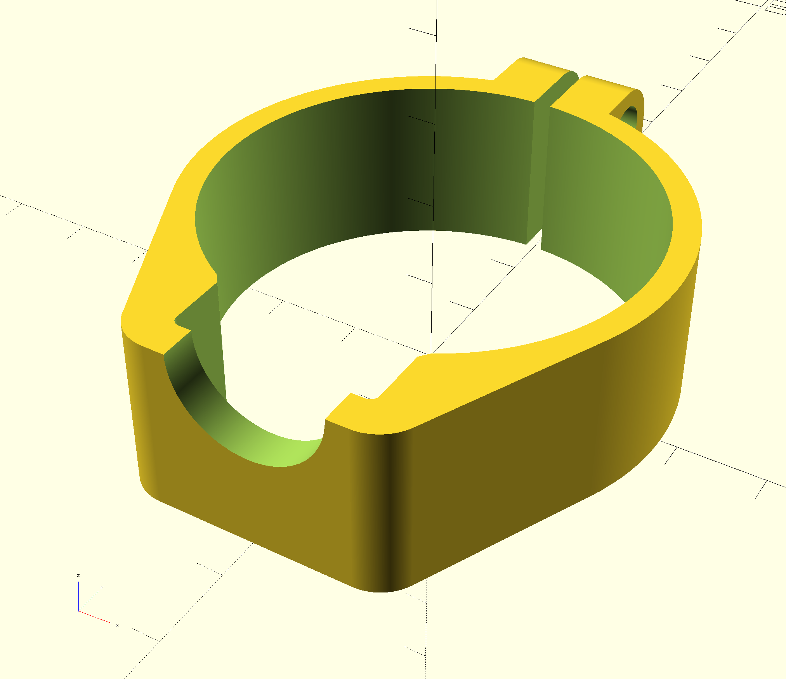

# Latch Clamp for Dyson "Fluffy" DC74
Clamp to reinforce broken Dyson fluffy (DC74) latch.

To be applied after gluing latch back in place; this clamp is to
relieve the strain and keep it from breaking again (or, alternatively,
from breaking in the first place... the design put a lot of stress on the
plastic around the latch).  

To assembly this you also need
two M3 x 15mm cap-head bolts and two M3 locknuts.  Low-profile 3mm height
will end up being flush with the surface, but regular locknuts will also work.
Regular nuts would work for a while but you might have to retighten the
clamp occasionally.

Printed in PETG at 100% infill for strength.

[Available from Thingiverse](https://www.thingiverse.com/thing:2964794)

[CC-BY 3.0 License](LICENSE.md)

